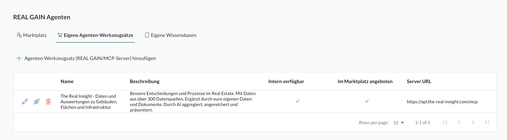
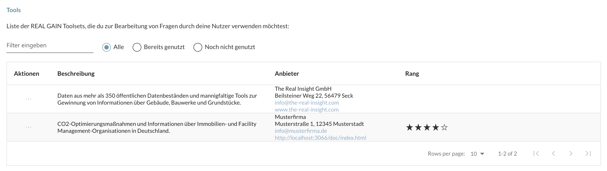

# REAL GAIN Reference Implementation

[REAL GAIN (German Real Estate AI Initiative)](https://www.real-gain.com) is a network of companies in the real estate and facility management business aiming at offering a broad spectrum of tools to be used in Agentic AI systems to provide comprehensive data and functionality for the management of buildings, land and structures.

# Roles

The REAL GAIN ecosystem includes several key roles:

- **REAL GAIN Agent Providers** supply their Agentic AI Tools via MCP servers, enabling access to data and business logic.  
  Interested in becoming an Agent Provider? Learn more [here](https://www.the-real-insight.com) and apply [here](https://www.the-real-insight.com).

- **REAL GAIN Solution Providers** integrate these tools into their own applications and offerings.  
  To join as a Solution Provider, sign up [here](https://www.the-real-insight.com).

- [**The Real Insight GmbH**](https://www.the-real-insight.com) serves as the **REAL GAIN Platform Provider**, offering a **Multimodal Chatbot** that orchestrates selected tools for all Solution Providers.  
  The platform includes a suite of built-in agents with access to real estate data from over 350 sources, along with tools for interpretation and visualization.  
  It also features an AI-powered app for fast data collection on technical building assets.

> **Special case**:  
> If your organization wants to use multimodal chatbot capabilities internally and also expose internal data or services to it,  
> you can become your own Agent Provider—connecting your own agents or using standard agents provided by your database or groupware systems.

# Metering and Billing

Agent Providers can define a named user-based billing plan for the use of their tools - if selected by another Solution Provider. The Real Insight will meter the usage, invoice the solution providers and pay the Agent Provider according to this plan.

# Reference Implementation

This reference implementation gives Agent Providers the boilerplate in Typescript and Python to implemented a REAL GAIN-compliant [Model Context Protocol (MCP) server](https://mcp.com), which can easily be registered and offered to Solution Providers on The Real Insight. Hereby, REAL GAIN sticks 100% to the MCP standard. We just add some minor functions on top. 

The beauty is: If you implement a REAL GAIN-compliant server, you can hook it into other ecosystems or platforms as well.

The reference implementation implements two examples of Agent Tools

* a tool to suggest CO2-reduction measures for a building
* a tool to provide data about relevant real estate and facility management organisations in Germany

# Agent Tools

## Tool Definition

The main task of providing an MCP server is defining *Agent Tools* exposing capabilities to generate responses on a category of questions, such as in this reference implementation

```typescript
 server.tool(
        'co2measures',
        'Ein Werkzeug zur Ermittlung von technische Massnahmen, die die CO2-Emissionen in einem Gebäude zu reduzieren und helfen die Klimeziele für das Gebäude zu erreichen.',
        ...
```

or 

```typescript
server.tool(
        'realEstateOrganizations',
        'Ein Werkzeug zur Ermittlung von wichtigen Immobilien- und Facility Management-Organisationen in Deutschland.',
        ...
```

These tools will then be dynamically picked by the **Agent Orchestration** in **The Real Insight** to contribute to answers on user prompts.

## Tool Parameters

Agent Tools can define parameters which will be populated by the Agent Orchestration, e.g.

```typescript
 server.tool(
        'co2measures',
        'Ein Werkzeug zur Ermittlung von technische Massnahmen, die die CO2-Emissionen in einem Gebäude zu reduzieren und helfen die Klimeziele für das Gebäude zu erreichen.',
        {
            area: z.number().describe('Fläche des Gebäudes in Quadratmetern'),
        },
```

> These parameters do not necessarily have to come from the user prompt. E.g. a tool may consume a list of technical assets in a > building to return a list of necessary maintenance tasks or checks as part of the operator's responsibility. 
> However, the user may only have provided the address of a building and the Agent Orchestration may have first invoked a tool to retrieve the technical assets for that building and then pass it to the tool mentioned above.

## Tool Responses

The generation of responses against the input parameters happens in the tool implementation

```typescript
 server.tool(
        'co2measures',
        'Ein Werkzeug zur Ermittlung von technische Massnahmen, die die CO2-Emissionen in einem Gebäude zu reduzieren und helfen die Klimaziele für das Gebäude zu erreichen.',
        {
            area: z.number().describe('Fläche des Gebäudes in Quadratmetern'),
        },
        async ({ area }: { area: number }, { sendNotification }: { sendNotification: (notification: any) => Promise<void> }): Promise<CallToolResult> => {

            // Your implementation code goes here

            return {
                    content: [{
                        type: 'text',
                        text: 'This is your response based on your implementation'
                    }],
                };
        ));
```

Hereby, your application code can do anything from simple calculations to database or document queries and even invocations of other Agent Tools you have access to.

# Multi-modal Responses

## MCP Resources

You can return arbitrary resources of yours in the tool response in the **url** or **blob** part of a tool response. If you return a **url** you are responsible for maintaining this URL and its logic so that users might access it even when the check their conversation history in the chatbot. 

## REAL GAIN-specific Predefined Resources

In addition to standard MCP responses, REAL GAIN supports a specific set of resource types allowing for multi-modal responses from REAL GAIN Agent Tools without implementing your own UX

* **Charts**
* **Maps**
* **Tables**
* **Reports**

The data and configurations of such a resource have to be base64-encoded into the *blob* field of the MCP resource, e.g.

```typescript
realGainResource = {
    type: 'chart',
    options: {...}
}

resource.blob = Buffer.from(JSON.stringify(realGainResource)).toString('base64')
```

## Charts

A REAL GAIN chart configuration is an exact match to the JSON representation of an [APEX Chart](https://apexcharts.com) chart configuration, e.g.

```json
{
    "type": "chart", 
    "chart": {
        "type": "donut",
        "series": [12, 34, 166, 3],
        "options": {
            "chart": {
                "type": "donut",
            },
            "labels": ["Kleinstunternehmen", "Kleinunternehmen", "Mittlere Unternehmen", "Großunternehmen"],
            "title": {
                "text": "Unternehmensgrößen"
            },
        },
    }
}
```

## Maps

Map are used to display single locations or shapes and their data on a map. E.g. the following code will render a map in the bounds of Germany

```json
{
    "type": "mapAndImage",
    "title": "Wichtige Immobilien- und Facility Management-Organisationen in Deutschland",
    "options": {
        "entityType": "PoI",
        "bounds": [[5.866667, 47.270111], [15.041667, 55.055556]],
        "zoom": 6,
    },
    "data": [...],
}
```

There are two flavors of the map **type**, *map* and *mapAndImage*. The latter renders a map which allows to switch to a satellite image.


### PoIs

Data provided in the **poi** section need to contain a **lat** and a **lon** field.

### Shapes

Data provided in the **shape** need to contain the geometry part of a [GeoJSON]() representation, that is

* a polygon
* a multi-polygon

e.g.

```json
````

or 

```json
```

### Legend

## Tables

A JSON table specification contains a **data** and and **options** section as follows

```json
{
    "data": [...],
    "options": {...}
}
```

The data section just contains the records to be displayed in the table, e.g.

```json
{
    "data": [{
        "name": "Schmitz Photovoltaik GmbH",
        "address": "Gansheimer Weg 22, 89089 Seck",
        "description": "Installation und Wartung von PV-Anlagen"
    }, ...],
}
```

The options section contains title and column specifications as follows

```json
{
    "options": {
        "title": "",
        "columns": [
            {
                "name": "Name",
                "field": "name",
                "width": "200px",
                "align": "left"
            }, {
                "name": "Addresse",
                "field": "address",
                "width": "300px",
                "align": "left"
            }, {
                "name": "Beschreibung",
                "field": "description",
                "width": "400px",
                "align": "left"
            },
        ]
    },
}
```

## Resulting Agent Orchestration in The Real Insight

Once you have published a server compliant to the above concepts a customer who has subscribed to your server(s) and available tools will automatically see their use in their requests, e.g.


and


# REAL GAIN-specific Information

We intend to keep the configuration efforts for enabling the use of your agents in **The Real Insight** as low as possible. Hence, the only activities required are 

* registering yourself as a customer in **The Real Insight** and
* registering the server URL of your REAL GAIN-compliant server once.

After that, all relevant changes can be initiated by changing and redeploying your server comprising

* providing information about billing plans
* providing detailed information and even marketing material on the tools implemented by your server

## Billing Plans

A REAL GAIN-compliant server needs to implement a GET endpoint **real-gain/plans** to return the available named-user based billing plans for the use of the tools provided with the corresponding MCP server.

An example is provided in the reference implementation as follows

```typescript
app.get('/real-gain/plans', async (req: Request, res: Response) => {
    res.json([{
        id: 'base3',
        name: 'Basis 3 Nutzende',
        rank: 1,
        description: 'Monatliche Grundgebühr von 30€/Monat, abzuschließen für 1 Jahr und zahlbar bei Abschluss, 10€ für jeden registrierten Nutzenden ab dem 4. Nutzenden in monatlicher Abrechnung.',
        meterings: [{ type: 'numberOfNamedUsersMetering', name: 'Weitere registrierte Nutzende', amount: 10.0, offset: 3 }],
        baseFee: 30.0,
        term: 12,
        billingPeriod: 'monthly',
        creationDate: dayjs('2024-07-01 00:00').toDate(),
        validFromDate: dayjs('2024-07-01 00:00').toDate(),
    }, {
        id: 'base10',
        name: 'Basis 10 Nutzende',
        rank: 2,
        description: 'Monatliche Grundgebühr von 80€/Monat, abzuschließen für 1 Jahr und zahlbar bei Abschluss, 8€ für jeden registrierten Nutzenden ab dem 11. Nutzenden in monatlicher Abrechnung.',
        meterings: [{ type: 'numberOfNamedUsersMetering', name: 'Weitere registrierte Nutzende', amount: 8.0, offset: 10 }],
        baseFee: 80.0,
        term: 12,
        billingPeriod: 'monthly',
        creationDate: dayjs('2024-07-01 00:00').toDate(),
        validFromDate: dayjs('2024-07-01 00:00').toDate(),
    }, {
        id: 'base30',
        name: 'Basis 30 Nutzende',
        rank: 3,
        description: 'Monatliche Grundgebühr von 180€/Monat, abzuschließen für 1 Jahr und zahlbar bei Abschluss, 6€ für jeden registrierten Nutzenden ab dem 31. Nutzenden in monatlicher Abrechnung.',
        meterings: [{ type: 'numberOfNamedUsersMetering', name: 'Weitere registrierte Nutzende', amount: 6.0, offset: 30 }],
        baseFee: 180.0,
        term: 12,
        billingPeriod: 'monthly',
        creationDate: dayjs('2024-07-01 00:00').toDate(),
        validFromDate: dayjs('2024-07-01 00:00').toDate(),
    }, {
        id: 'base100',
        name: 'Basis 100 Nutzende',
        rank: 4,
        description: 'Monatliche Grundgebühr von 400€/Monat, abzuschließen für 1 Jahr und zahlbar bei Abschluss, 4€ für jeden registrierten Nutzenden ab dem 101. Nutzenden in monatlicher Abrechnung.',
        meterings: [{ type: 'numberOfNamedUsersMetering', name: 'Weitere registrierte Nutzende', amount: 4.0, offset: 100 }],
        baseFee: 400.0,
        term: 12,
        billingPeriod: 'monthly',
        creationDate: dayjs('2024-07-01 00:00').toDate(),
        validFromDate: dayjs('2024-07-01 00:00').toDate(),
    }]);
});
```

## Storefront Info

To provide general information about the tools offered by your server and potentially details about your company, you need to implement the GET method for **real-gain/storefront-info**. This endpoint should return the following structure

```json
{
    "synopsis": "...",
    "description": "...", 
    "dataProtectionURL": "...", 
    "termsAndConditionsURL": "...",
    "supportURL": "..."
}
```

Hereby

* **synopsis** is a mandatory, short textual description of not more than 150 characters.
* **description** is a mandatory, long description of the provided tools [markdown](https://en.wikipedia.org/wiki/Markdown) text.
* **dataProtection** is a mandatory link to provide details of your data protection rules and measures including the perspective of the GDPR.
* **termsAndConditions** is a mandatory link to your terms and conditions as the basis for the procurement by a a Solution Provider.
* **supportURL** is a mandatory link to allow users to submit support requests.

# Registration of a REAL GAIN Server

To register a REAG GAIN MCP-Server, first create an account on [The Real Insight](https://www.the-real-insight.com).

Then click on the user icon in your header bar and select ***Einstellungen**


In the sidebar then select **Agenten**. 


In the **REAL GAIN Agents** section select **Add REAL GAIN/MCP Server**



and in the corresponding dialog enter the production URL of your REAL GAIN server according to the above specification.


The server should be tested and up and running as its APIs are immediately validated and only added after successful validation.

Now, other customers on **The Real Insight** will be able to select and procure access to your server in the **Agent Tools** section like 



and


The resulting procurement establishes a supplier/consumer contract with you and the Solution Provider based on the provided terms and conditions.

Once a server is procured by a customer its tools will always be considered when the Agent Orchestration decides they are valuable to help with a user prompt.

You will then receive payments from this customer for the order period according to your billing model. For more details see [Billing and Payment](https://the-real-insight.com).

# Test Clients

Both reference implementations provide a test client to immediately test the server implementation.

Alternatively, you can use the [MCP Inspector](https://github.com/modelcontextprotocol/inspector).

You can also procure access to your own servers in **The Real Insight**

# Security

# Implementations

## Typescript Details

The Typescript implementation provides a **NodeJS/Express Server**.

## Python Details

The Python implementation provides a **PythonPi** Server.


